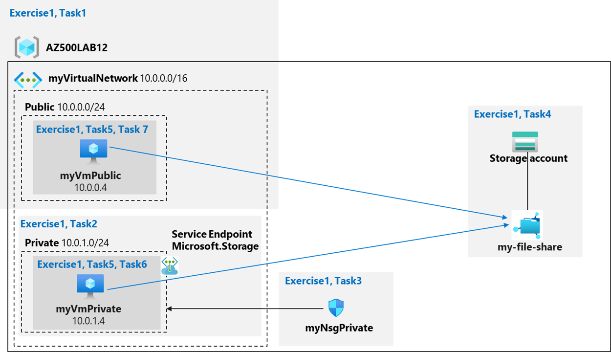

---
lab:
    title: ' 06 - Service Endpoints and Securing Storage'
    module: 'Module 03 - Plan and implement security for Azure SQL Database and Azure SQL Managed Instance'
---

# Lab 06: Service Endpoints and Securing Storage
# Student lab manual

## Lab scenario

You have been asked to create a proof of concept to demonstrate securing Azure file shares. Specifically, you want to:
	
- Create a storage endpoint so traffic destined to Azure Storage always stays within the Azure backbone network.
- Configure the storage endpoint so only resources from a specific subnet can access the storage.
- Confirm that resources outside of the specific subnet cannot access the storage. 

> For all the resources in this lab, we are using the **East US** region. Verify with your instructor this is the region to use for class. 

## Lab objectives

In this lab, you will complete the following exercise:

- Exercise 1: Service endpoints and security storage

## Service Endpoints and Securing Storage diagram



## Instructions

### Exercise 1: Service endpoints and security storage

### Estimated timing: 45 minutes

In this exercise, you will complete the following tasks:

- Task 1: Create a virtual network
- Task 2: Add a subnet to the virtual network and configure a storage endpoint
- Task 3: Configure a network security group to restrict access to the subnet
- Task 4: Configure a network security group to allow rdp on the public subnet
- Task 5: Create a storage account with a file share
- Task 6: Deploy virtual machines into the designated subnets
- Task 7: Test the storage connection from the private subnet to confirm that access is allowed
- Task 8: Test the storage connection from the public subnet to confirm that access is denied 

#### Task 1: Create a virtual network

In this task, you will create a virtual network.

1. Sign-in to the Azure portal **`https://portal.azure.com/`**.

    >**Note**: Sign in to the Azure portal using an account that has the Owner or Contributor role in the Azure subscription you are using for this lab.

2. In the Azure portal, in the **Search resources, services, and docs** text box at the top of the Azure portal page, type **Virtual networks** and press the **Enter** key.

3. On the **Virtual Networks** blade, click **+ Create**.

4. On the **Basics** tab of the **Create virtual network** blade, specify the following settings (leave others with their default values) and click **Next: IP Addresses**:

    |Setting|Value|
    |---|---|
    |Subscription|the name of the Azure subscription you are using in this lab|
    |Resource group|click **Create new** and type the name **AZ500LAB12**|
    |Name|**myVirtualNetwork**|
    |Region|**(US) East US**|

5. On the **IP addresses** tab of the **Create virtual network** blade, set the **IPv4 address space** to **10.0.0.0/16**, in the **Subnet name** column, click **default** and, on the **Edit subnet** blade, specify the following settings and click **Save**:

    |Setting|Value|
    |---|---|
    |Subnet name|**Public**|
    |Subnet address range|**10.0.0.0/24**|

6. Back on the **IP addresses** tab of the **Create virtual network** blade, click **Review + create**.

7. On the **Review + create** tab of the **Create virtual network** blade, click **Create**.

#### Task 2: Add a subnet to the virtual network and configure a storage endpoint

In this task, you will create another subnet and enable a service endpoint on that subnet. Service endpoints are enabled per service, per subnet. 

1. In the Azure portal, navigate back to the **Virtual Networks** blade.

2. On the **Virtual networks** blade, click the **myVirtualNetwork** entry.

3. On the **myVirtualNetwork** blade, in the **Settings** section, click **Subnets**.

4. On the **myVirtualNetwork \| Subnets** blade, click **+ Subnet**. 

5. On the **Add subnet** blade, specify the following settings (leave others with their default values):

    |Setting|Value|
    |---|---|
    |Subnet name|**Private**|
    |Subnet address range|**10.0.1.0/24**|
    |Service endpoints|**Leave the default of None**|

6. On the **Add subnet** blade, click **Save** to add the new subnet.

    >**Note**: The virtual network now has two subnets: Public and Private. 
	
#### Task 3: Configure a network security group to restrict access to the subnet

In this task, you will create a network security group with two outbound security rules (Storage and internet) and one inbound security rule (RDP). You will also associate the network security group with the Private subnet. This will restrict outbound traffic from Azure VMs connected to that subnet.

1. In the Azure portal, in the **Search resources, services, and docs** text box at the top of the Azure portal page, type **Network security groups** and press the **Enter** key.

2. On the **Network security groups** blade, click **+ Create**.

3. On the **Basics** tab of the **Create network security group** blade, specify the following settings: 

    |Setting|Value|
    |---|---|
    |Subscription|the name of the Azure subscription you are using in this lab|
    |Resource group|**AZ500LAB12**|
    |Name|**myNsgPrivate**|
    |Region|**East US**|

4. Click **Review + create** and then click **Create**.

    >**Note**: In the next steps, you will create an outbound security rule that allows communication to the Azure Storage service. 

5. In the Azure portal, navigate back to the **Network security groups** blade and click the **myNsgPrivate** entry.

6. On the **myNsgPrivate** blade, in the **Settings** section, click **Outbound security rules**.

7. On the **myNsgPrivate \| Outbound security rules** blade, click **+ Add**.

8. On the **Add outbound security rule** blade, specify the following settings to explicitly allow outbound traffic to Azure Storage (leave all other values with their default settings): 

    |Setting|Value|
    |---|---|
    |Source|**Service Tag**|
    |Source service tag|**VirtualNetwork**|
    |Source port ranges|**\***|
    |Destination|**Service Tag**|
    |Destination service tag|**Storage**|
    |Destination port ranges|**\***|
    |Protocol|**Any**|
    |Action|**Allow**|
    |Priority|**1000**|
    |Name|**Allow-Storage-All**|

9. On the **Add outbound security rule** blade, click **Add** to create the new outbound rule. 

10. On the **myNsgPrivate** blade, in the **Settings** section, click **Outbound security rules**, and then click **+ Add**.

11. On the **Add outbound security rule** blade, specify the following settings to explicitly deny outbound traffic to Internet (leave all other values with their default settings): 

    |Setting|Value|
    |---|---|
    |Source|**Service Tag**|
    |Source service tag|**VirtualNetwork**|
    |Source port ranges|**\***|
    |Destination|**Service Tag**|
    |Destination service tag|**Internet**|
    |Destination port ranges|**\***|
    |Protocol|**Any**|
    |Action|**Deny**|
    |Priority|**1100**|
    |Name|**Deny-Internet-All**|

    >**Note**: This rule overrides a default rule in all network security groups that allows outbound internet communication. 

    >**Note**: In the next steps, you will create an inbound security rule that allows Remote Desktop Protocol (RDP) traffic to the subnet. The rule overrides a default security rule that denies all inbound traffic from the internet. Remote Desktop connections are allowed to the subnet so that connectivity can be tested in a later step.

12. On the **myNsgPrivate** blade, in the **Settings** section, click **Inbound security rules** and then click **+ Add**.

13. On the **Add inbound security rule** blade, specify the following settings (leave all other values with their default values): 

    |Setting|Value|
    |---|---|
    |Source|**Any**|
    |Source port ranges|**\***|
    |Destination|**Service Tag**|
    |Destination service tag|**VirtualNetwork**|
    |Destination port ranges|**3389**|
    |Protocol|**TCP**|
    |Action|**Allow**|
    |Priority|**1200**|                                                    
    |Name|**Allow-RDP-All**|

14. On the **Add inbound security rule** blade, click **Add** to create the new inbound rule. 

    >**Note**: Now you will associate the network security group with the Private subnet.

15. On the **Subnets** blade, select **+ Associate** and specify the following settings in the **Associate subnet** section and then click **OK**:

    |Setting|Value|
    |---|---|
    |Virtual network|**myVirtualNetwork**|
    |Subnet|**Private**|

#### Task 4: Configure a network security group to allow rdp on the public subnet

In this task, you will create a network security group with one inbound security rule (RDP). You will also associate the network security group with the Public subnet. This will allow RDP access to the Public VM.

1. In the Azure portal, in the **Search resources, services, and docs** text box at the top of the Azure portal page, type **Network security groups** and press the **Enter** key.

2. On the **Network security groups** blade, click **+ Create**.

3. On the **Basics** tab of the **Create network security group** blade, specify the following settings: 

    |Setting|Value|
    |---|---|
    |Subscription|the name of the Azure subscription you are using in this lab|
    |Resource group|**AZ500LAB12**|
    |Name|**myNsgPublic**|
    |Region|**East US**|

4. Click **Review + create** and then click **Create**.

    >**Note**: In the next steps, you will create an outbound security rule that allows communication to the Azure Storage service. 

5. In the Azure portal, navigate back to the **Network security groups** blade and click the **myNsgPublic** entry.

6. On the **myNsgPublic** blade, in the **Settings** section, click **Inbound security rules** and then click **+ Add**.

7. On the **Add inbound security rule** blade, specify the following settings (leave all other values with their default values): 

    |Setting|Value|
    |---|---|
    |Source|**Any**|
    |Source port ranges|**\***|
    |Destination|**Service Tag**|
    |Destination service tag|**VirtualNetwork**|
    |Destination port ranges|**3389**|
    |Protocol|**TCP**|
    |Action|**Allow**|
    |Priority|**1200**|                                                    
    |Name|**Allow-RDP-All**|

8. On the **Add inbound security rule** blade, click **Add** to create the new inbound rule. 

    >**Note**: Now you will associate the network security group with the Public subnet.

9. On the **Subnets** blade, select **+ Associate** and specify the following settings in the **Associate subnet** section and then click **OK**:

    |Setting|Value|
    |---|---|
    |Virtual network|**myVirtualNetwork**|
    |Subnet|**Public**|
    
#### Task 5: Create a storage account with a file share

In this task, you will create a storage account with a file share and obtain the storage account key.  

1. In the Azure portal, in the **Search resources, services, and docs** text box at the top of the Azure portal page, type **Storage accounts** and press the **Enter** key.

2. On the **Storage accounts** blade, click **+ Create**.

3. On the **Basics** tab of the **Create storage account** blade, specify the following settings (leave others with their default values):

    |Setting|Value|
    |---|---|
    |Subscription|the name of the Azure subscription you are using in this lab|
    |Resource group|**AZ500LAB12**|
    |Storage account name|any globally unique name between 3 and 24 in length consisting of letters and digits|
    |Location|**(US) EastUS**|
    |Performance|**Standard (general-purpose v2 account)**|
    |Redundency|**Locally redundant storage (LRS)**|

4. On the **Basics** tab of the **Create storage account** blade, click **Review + Create**, wait for the validation process to complete, and click **Create**.

    >**Note**: Wait for the Storage account to be created. This should take about 2 minutes.

5. In the Azure portal, in the **Search resources, services, and docs** text box at the top of the Azure portal page, type **Resource groups** and press the **Enter** key.

6. On the **Resource groups** blade, in the list of resource group, click the **AZ500LAB12** entry.

7. On the **AZ500LAB12** resource group blade, in the list of resources, click the entry representing the newly created storage account.

8. On the storage account **Overview** blade, click **File Shares** under the **Data storage** tab, and then click **+ File Share**.

9. On the **New file share** blade, untick the **Enable backup** option in the backup tab. 

10. On the **New file share** blade, specify the following settings:

    |Setting|Value|
    |---|---|
    |Name|**my-file-share**|

11. On the **New file share** blade, click **Create**.

    >**Note**: Now, retrieve and record the PowerShell script that creates a drive mapping to the Azure file share. 

12. On the storage account blade, in the list of file shares, click **my-file-share**.

13. On the **my-file-share** blade, click **Connect**.

14. On the **Connect** blade, on the **Windows** tab, copy the PowerShell script that creates a Z drive mapping to the file share. 

    >**Note**: Record this script. You will need this in a later in this lab in order to map the file share from the Azure virtual machine on the **Private** subnet.

15. Navigate back to the storage account blade, then in the **Security + networking** section, click **Networking**.

16. Under **Public network access** select **Manage** and as **Default action** select **Enable from selected networks**.

17. Under **Resource settings: Virtual networks, IP adresses, and exceptions** blade, select **view** and click the **+ Add existing virtual network** link. 

18. On the **Add networks** blade, specify the following settings:

    |Setting|Value|
    |---|---|
    |Subscription|the name of the Azure subscription you are using in this lab|
    |Virtual networks|**myVirtualNetwork**|
    |Subnets|**Private**|

19. On the **Add networks** blade, click **Add**. 

20. Back on the storage account blade, click **Save**.

    >**Note**: At this point in the lab you have configured a virtual network, a network security group, and a storage account with a file share. 

#### Task 6: Deploy virtual machines into the designated subnets

In this task, you will create two virtual machines one in the Private subnet and one in the Public subnet. 

>**Note**: The first virtual machine will be connected to the Private subnet.

1. In the Azure portal, in the **Search resources, services, and docs** text box at the top of the Azure portal page, type **Virtual machines** and press the **Enter** key.

2. On the **Virtual machines** blade, click **+ Create** and, in the dropdown list, click **+ Azure Virtual machine**

3. On the **Basics** tab of the **Create a virtual machine** blade, specify the following settings (leave others with their default values):

    |Setting|Value|
    |---|---|
    |Subscription|the name of the Azure subscription you will be using in this lab|
    |Resource group|**AZ500LAB12**|
    |Virtual machine name|**myVmPrivate**|
    |Region|**(US)East US**|
    |Image|**Windows Server 2022 Datacenter: Azure Edition - Gen 2**|
    |Username|**Student**|
    |Password|**Please use your personal password created in Lab 02 > Exercise 2 > Task 1 > Step 3.**|
    |Public inbound ports|**None**|
    |Already have a Windows Server license|**Not selected**|

    >**Note**: For public inbound ports, we will rely on the precreated NSG. 

4. Click **Next: Disks >** and, on the **Disks** tab of the **Create a virtual machine** blade, set the **OS disk type** to **Standard HDD** and click **Next: Networking >**.

5. Click **Next: Networking >**, on the **Networking** tab of the **Create a virtual machine** blade, specify the following settings (leave others with their default values):

    |Setting|Value|
    |---|---|
    |Virtual network|**myVirtualNetwork**|
    |Subnet|**Private (10.0.1.0/24)**|
    |Public IP|**(new)myVmPrivate-ip**|
    |NIC network security group|**None**|

6. Click **Next: Management >**, on the **Management** tab of the **Create a virtual machine** blade, accept the default settings and click **Review + create**.

7. On the **Review + create** blade, ensure that validation was successful and click **Create**.

    >**Note**: The second virtual machine will be connected to the Public subnet.

8. On the **Virtual machines** blade, click **+ Add** and, in the dropdown list, click **+ Azure Virtual machine**.

9. On the **Basics** tab of the **Create a virtual machine** blade, specify the following settings (leave others with their default values):

    |Setting|Value|
    |---|---|
    |Subscription|the name of the Azure subscription you will be using in this lab|
    |Resource group|**AZ500LAB12**|
    |Virtual machine name|**myVmPublic**|
    |Region|**(US)East US**|
    |Image|**Windows Server 2022 Datacenter: Azure Edition - Gen 2**|
    |Username|**Student**|
    |Password|**Please use your personal password created in Lab 02 > Exercise 1 > Task 1 > Step 9.**|
    |Public inbound ports|**None**|
    |Already have a Windows Server license|**Not selected**|

    >**Note**: For public inbound ports, we will rely on the precreated NSG. 

10. Click **Next: Disks >** and, on the **Disks** tab of the **Create a virtual machine** blade, set the **OS disk type** to **Standard HDD** and click **Next: Networking >**.

11. Click **Next: Networking >**, on the **Networking** tab of the **Create a virtual machine** blade, specify the following settings (leave others with their default values):

    |Setting|Value|
    |---|---|
    |Virtual network|**myVirtualNetwork**|
    |Subnet|**Public (10.0.0.0/24)**|
    |Public IP|**(new)myVmPublic-ip**|
    |NIC network security group|**None**|

12. Click **Next: Management >**, on the **Management** tab of the **Create a virtual machine** blade, accept the default settings and click **Review + create**.

13. On the **Review + create** blade, ensure that validation was successful and click **Create**.

    >**Note**: You can continue to the next task once the deployment of the **myVMPublic** Azure VM is completed.

#### Task 7: Test the storage connection from the private subnet to confirm that access is allowed

In this task, you will connect to the myVMPrivate virtual machine via Remote Desktop and map a drive to the file share. 

1. Navigate back to the **Virtual machines** blade. 

2. On the **Virtual machines** blade, click the **myVMPrivate** entry.

3. On the **myVMPrivate** blade, click **Connect** and, in the drop down menu, click **Connect**. 

4. Download the RDP file and use it to connect to the **myVMPrivate** Azure VM via Remote Desktop. When prompted to authenticate, provide the following credntials:

    |Setting|Value|
    |---|---|
    |Username|**Student**|
    |Password|**Please use your personal password created in Lab 02 > Exercise 2 > Task 1 > Step 3.**|
     

    >**Note**: Wait for the Remote Desktop session to open and Server Manager to load.

    >**Note**: You will now map drive Z to an Azure File share within the Remote Desktop session to a Windows Server 2022 computer

5. Within the Remote Desktop session to **myVMPrivate**, click **Start** and then click **Windows PowerShell ISE**.

6. Within the **Windows PowerShell ISE** window, open the **Script** pane, then paste and run the PowerShell script that you recorded earlier in this lab. The script has the following format:

    ```powershell
    $connectTestResult = Test-NetConnection -ComputerName <storage_account_name>.file.core.windows.net -Port 445
    if ($connectTestResult.TcpTestSucceeded) {
       # Save the password so the drive will persist on reboot
       cmd.exe /C "cmdkey /add:`"<storage_account_name>.file.core.windows.net`" /user:`"localhost\<storage_account_name>`"  /pass:`"<storage_account_key>`""
       # Mount the drive
       New-PSDrive -Name Z -PSProvider FileSystem -Root "\\<storage_account_name>.file.core.windows.net\my-file-share" -Persist
    } else {
       Write-Error -Message "Unable to reach the Azure storage account via port 445. Check to make sure your organization or ISP is not blocking port 445, or use Azure P2S VPN, Azure S2S VPN, or Express Route to tunnel SMB traffic over a different port."
    }
    ```
    >**Note**: The `<storage_account_name>` placeholder represents the name of the storage account hosting the file share and `<storage_account_key>` one its primary key

7. Start File Explorer and verify that the Z: drive mapping has been successfully created.

8. Next, from the console pane of the **Windows PowerShell ISE** console, run the following to verify that the virtual machine has no outbound connectivity to the internet:

    ```powershell
    Test-NetConnection -ComputerName www.bing.com -Port 80
    ```

    >**Note**: The test will fail because the network security group associated with the Private subnet does not allow outbound access to the internet.

9. Terminate the Remote Desktop session to the **myVMPrivate** Azure VM.

    >**Note**: At this point, you have confirmed that the virtual machine in the Private subnet can access the storage account. 

####  Task 8: Test the storage connection from the public subnet to confirm that access is denied 

1. Navigate back to the **Virtual machines** blade. 

2. On the **Virtual machines** blade, click the **myVMPublic** entry.

3. On the **myVMPublic** blade, click **Connect** and, in the drop down menu, click **Connect**. 

4. Click **Connect via RDP** and use it to connect to the **myVMPublic** Azure VM via Remote Desktop. When prompted to authenticate, provide the following credntials:

    |Setting|Value|
    |---|---|
    |Username|**Student**|
    |Password|**Please use your personal password created in Lab 02 > Exercise 2 > Task 1 > Step 3.**|


    >**Note**: Wait for the Remote Desktop session to open and Server Manager to load.

    >**Note**: You will now map drive Z to an Azure File share within the Remote Desktop session to a Windows Server 2022 computer

5. Within the Remote Desktop session to **myVMPublic**, click **Start** and then click **Windows PowerShell ISE**.

6. Within the **Windows PowerShell ISE** window, open the **Script** pane, then paste and run the same PowerShell script that you ran within the Remote Desktop session to the **myVMPrivate** Azure VM.

    >**Note**: This time, you will receive the **New-PSDrive : Access is denied** error. 

    >**Note**: Access is denied because the *myVmPublic* virtual machine is deployed in the Public subnet. The Public subnet does not have a service endpoint enabled for the Azure Storage. The storage account only allows network access from the Private subnet.

7. Next, from the console pane of the **Windows PowerShell ISE** console, run the following to verify that the virtual machine has outbound connectivity to the internet: 

    ```powershell
    Test-NetConnection -ComputerName www.bing.com -Port 80
    ```

    >**Note**: The test will succeed because there is no outbound security rule to deny internet on the Public subnet.

8. Terminate the Remote Desktop session to the **myVMPublic** Azure VM.

    >**Note**: At this point, you have confirmed that the virtual machine in the Public subnet cannot access the storage account, but has access to the internet.


**Clean up resources**

> Remember to remove any newly created Azure resources that you no longer use. Removing unused resources ensures you will not incur unexpected costs. 
