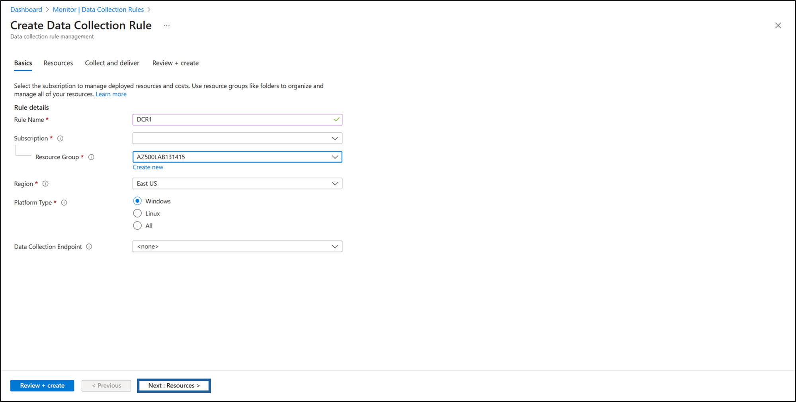
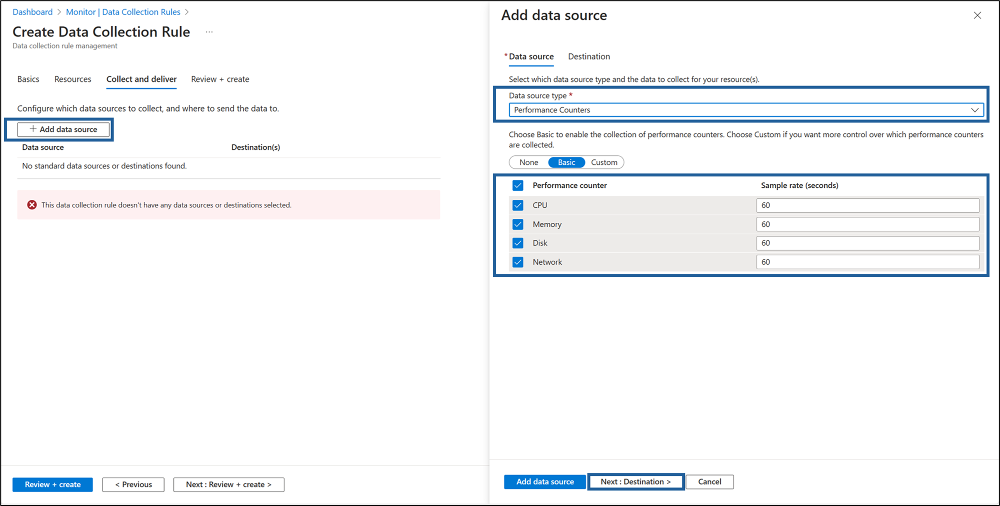
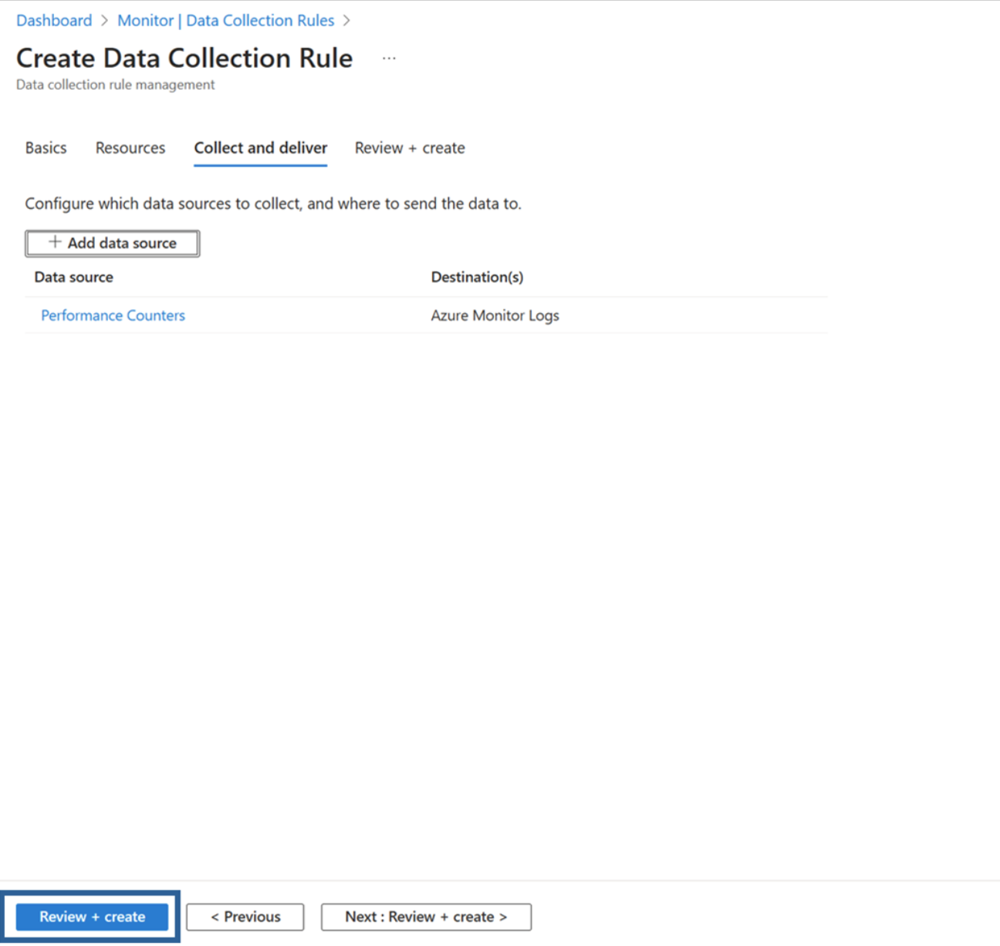
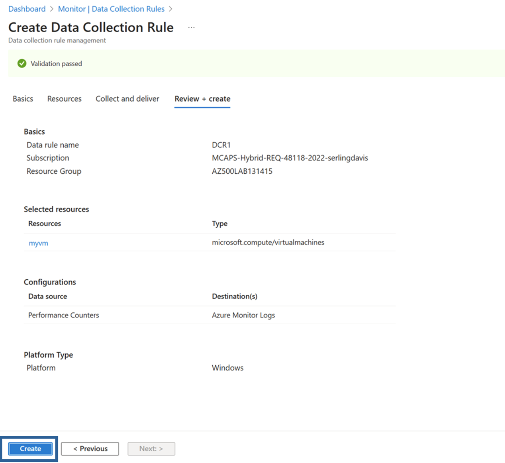

---
lab:
    title: '08 - Create a Log Analytics Workspace, Azure Storage Account, and Data Collection Rule (DCR)' 
    module: 'Module 03 - Configure and manage threat protection by using Microsoft Defender for Cloud'
---

# Lab 08: Create a Log Analytics Workspace, Azure Storage Account, and Data Collection Rule (DCR)

# Student lab manual

## Lab scenario

As an Azure Security Engineer for a financial technology company, you are tasked with enhancing monitoring and security visibility across all Azure virtual machines (VMs) used for processing financial transactions and managing sensitive customer data. The security team requires detailed logs and performance metrics from these VMs to detect potential threats and optimize system performance. The Chief Information Security Officer (CISO) has asked you to implement a solution that collects security events, system logs, and performance counters. You have been assigned to configure the Azure Monitor Agent (AMA) along with Data Collection Rules (DCRs) to centralize log collection and performance monitoring.


> For all the resources in this lab, we are using the **East US** region. Verify with your instructor this is the region to use for class. 

## Lab objectives

In this lab, you will complete the following exercises:

- Exercise 1: Deploy an Azure virtual machine
- Exercise 2: Create a Log Analytics workspace
- Exercise 3: Create an Azure storage account
- Exercise 4: Create a data colllection rule
  
## Instructions

### Exercise 1: Deploy an Azure virtual machine

### Exercise timing: 10 minutes

In this exercise, you will complete the following tasks: 

#### Task 1: Deploy an Azure virtual machine

1. Sign-in to the Azure portal **`https://portal.azure.com/`**.

    >**Note**: Sign in to the Azure portal using an account that has the Owner or Contributor role in the Azure subscription you are using for this lab.

2. Open the Cloud Shell by clicking the first icon in the top right of the Azure Portal. If prompted, select **PowerShell**.

3. Ensure **PowerShell** is selected in the drop-down menu in the upper-left corner of the Cloud Shell pane.

4. In the **Getting started** window, leave the default setting as is: **Select a subscription to get started. You can optionally mount a storage account to persist files between sessions. No storage account required.**

5. From the **Subscription** drop-down menu, select your **lodsubscription.**

6. Leave **Use an existing private virtual network** unchecked, then click **Apply.**

7. In the PowerShell session within the Cloud Shell pane, run the following to create a resource group that will be used in this lab:
  
    ```powershell
    New-AzResourceGroup -Name AZ500LAB131415 -Location 'EastUS'
    ```

    >**Note**: This resource group will be used for labs 8, 9, and 10.

8. In the PowerShell session within the Cloud Shell pane, run the following to enable encryption at host (EAH)
   
   ```powershell
    Register-AzProviderFeature -FeatureName "EncryptionAtHost" -ProviderNamespace Microsoft.Compute 
    ```

5. In the PowerShell session within the Cloud Shell pane, run the following to create a new Azure virtual machine. 

    ```powershell
    New-AzVm -ResourceGroupName "AZ500LAB131415" -Name "myVM" -Location 'EastUS' -VirtualNetworkName "myVnet" -SubnetName "mySubnet" -SecurityGroupName   "myNetworkSecurityGroup" -PublicIpAddressName "myPublicIpAddress" -PublicIpSku Standard -OpenPorts 80,3389 -Size Standard_D2s_v3 
    ```
    
6.  When prompted for credentials:

    |Setting|Value|
    |---|---|
    |User |**localadmin**|
    |Password|**Please use your personal password created in Lab 02 > Exercise 2 > Task 1 > Step 3.**|

    >**Note**: Wait for the deployment to complete. 

7. In the PowerShell session within the Cloud Shell pane, run the following to confirm that the virtual machine named **myVM** was created and its **ProvisioningState** is **Succeeded**.

    ```powershell
    Get-AzVM -Name 'myVM' -ResourceGroupName 'AZ500LAB131415' | Format-Table
    ```

8. Close the Cloud Shell pane. 

### Exercise 2: Create an Log Analytics workspace

### Exercise timing: 10 minutes

In this exercise, you will complete the following tasks: 

#### Task 1: Create a Log Analytics workspace

In this task, you will create a Log Analytics workspace. 

1. In the Azure portal, in the **Search resources, services, and docs** text box at the top of the Azure portal page, type **Log Analytics workspaces** and press the **Enter** key.

2. On the **Log Analytics workspaces** blade, click **+ Create**.

3. On the **Basics** tab of the **Create Log Analytics workspace** blade, specify the following settings (leave others with their default values):

    |Setting|Value|
    |---|---|
    |Subscription|the name of the Azure subscription you are using in this lab|
    |Resource group|**AZ500LAB131415**|
    |Name|any valid, globally unique name|
    |Region|**East US**|

4. Select **Review + create**.

5. On the **Review + create** tab of the **Create Log Analytics workspace** blade, select **Create**.

### Exercise 3: Create an Azure storage account

### Estimated timing: 10 minutes

In this exercise, you will complete the following tasks:

#### Task 1: Create an Azure storage account

In this task, you will create a storage account.

1. In the Azure portal, in the **Search resources, services, and docs** text box at the top of the Azure portal page, type **Storage accounts** and press the **Enter** key.

2. On the **Storage accounts** blade in the Azure portal, click the **+ Create** button to create a new storage account.

3. On the **Basics** tab of the **Create storage account** blade, specify the following settings (leave others with their default values):

    |Setting|Value|
    |---|---|
    |Subscription|the name of the Azure subscription you are using in this lab|
    |Resource group|**AZ500LAB131415**|
    **Instance details**
    |Storage account name|any globally unique name between 3 and 24 in length consisting of letters and digits|
    |Region|**(US) EastUS**|
    |Primary service|**Azure Blob Storage or Azure Data Lake Storage Gen 2**|
    |Performance|**Standard (general-purpose v2 account)**|
    |Redundancy|**Locally redundant storage (LRS)**|

5. On the **Basics** tab of the **Create storage account** blade, click **Review + create.** After the validation process completes, click **Create.**

    >**Note**: Wait for the Storage account to be created. This should take about 2 minutes.

### Exercise 4: Create a Data Collection Rule

### Estimated timing: 15 minutes

In this exercise, you will complete the following tasks:

#### Task 1: Create a Data Collection Rule.

In this task, you will create a data collection rule.

1. In the Azure portal, in the **Search resources, services, and docs** text box at the top of the Azure portal page, type **Monitor** and press the **Enter** key.

2. On the **Monitor Settings** blade, click **Data Collection Rules.**

3. Click the **+ Create** button to create a new data collection rule.

4. On the **Basics** tab of the **Create Data Collection Rule** blade, specify the following settings:
  
    |Setting|Value|
    |---|---|
    **Rule details**
    |Rule Name|**DCR1**|
    |Subscription|the name of the Azure subscription you are using in this lab|
    |Resource Group|**AZ500LAB131415**|
    |Region|**East US**|
    |Platform Type|**Windows**|
    |Data Collection Endpoint|*Leave Blank*|

    


5. Click on the button labeled **Next: Resources >** to proceed.
   
6. On the **Resources** page, select + **Add resources.**

7. In the **Select a scope** template, check the **Subscription** box in the **Scope.**

8. At the bottom of the **Select a scope** template, click **Apply.**

9. At the bottom of the **Resources** page, select **Next: Collect and deliver >.**

10. Click **+ Add data source**, then on the **Add data source** page, change the **Data source type** drop-down menu to display **Performance Counters.** Leave the following default settings:

    |Setting|Value|
    |---|---|
    |**Performance counter**|**Sample rate (seconds)**|
    |CPU|60|
    |Memory|60|
    |Disk|60|
    |Network|60|

   

11. Click on the button labeled **Next: Destination >** to proceed.
  
12. Click **+ Add destination**, change the **Destination type** drop-down menu to display **Azure Monitor Logs.** In the **Subscription** window, ensure that your *Subscription* is displayed, then change the **Account or namespace** drop-down menu to reflect your previously created Log Analytics Workspace.

13. Click on **Add data source** at the bottom of the page.
    
    

14. Click **Review + create.**

    

15. Click **Create.**

> Results: You deployed an Azure virtual machine, Log Analytics workspace, Azure storage account, and a data collection rule to collect events and performance counters from virtual machines with Azure Monitor Agent.

>**Note**: Do not remove the resources from this lab, as they are needed for the Microsoft Defender for Cloud lab, the 'Enable just-in-time access on VMs' lab, and the Microsoft Sentinel lab
 
