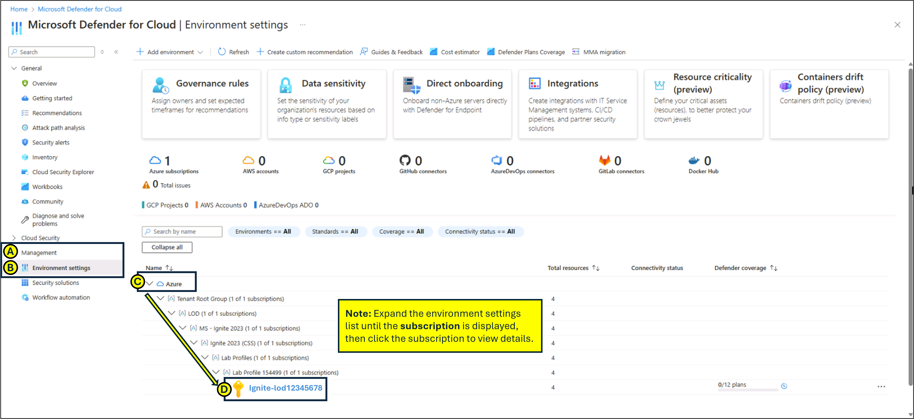
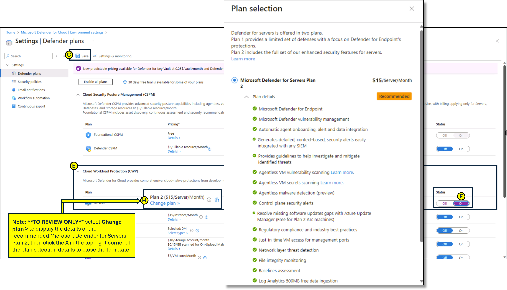

---
lab:
    title: '09 - Configuring Microsoft Defender for Cloud Enhanced Security Features for Servers'
    module: 'Module 03 - Configure and manage threat protection by using Microsoft Defender for Cloud'
---

# Lab 09: Configuring Microsoft Defender for Cloud Enhanced Security Features for Servers

# Student lab manual

## Lab scenario

As an Azure Security Engineer for a global e-commerce company, you are responsible for securing the company’s cloud infrastructure. The organization relies heavily on Azure virtual machines (VMs) and on-premises servers to run critical applications, manage customer data, and process transactions. The Chief Information Security Officer (CISO) has identified the need for enhanced security measures to protect these resources against cyber threats, vulnerabilities, and misconfigurations. You have been tasked with enabling Microsoft Defender for Servers in Microsoft Defender for Cloud to provide advanced threat protection and security monitoring for both Azure VMs and hybrid servers.

## Lab objectives

- Configure Microsoft Defender for Cloud Enhanced Security Features for Servers
  
- Review the ehanced security features for Microsoft Defender for Servers Plan 2

## Exercise instructions

### Configure Microsoft Defender for Cloud Enhanced Security Features for Servers

1. In the Azure portal, in the Search resources, services, and docs text box at the top of the Azure portal page, type **Microsoft Defender for Cloud** and press the **Enter** key.

2. On the **Microsoft Defender for Cloud**, **Management blade**, go to the **Environment settings**. Expand the environment settings folders until the **subscription** section is displayed, then click the **subscription** to view details.

   
   
3. In the **Settings** blade, under **Defender plans**, expand **Cloud Workload Protection (CWP)**.

4. From the **Cloud Workload Protection (CWP) Plan** list, select **Servers**. On the right side of the page, change the **Status** from **Off** to **On**, then click **Save**.

5. To review the details of **Microsoft Defender for Servers Plan 2**, select **Change plan >**.

   Note: Enabling the Cloud Workload Protection (CWP) Servers plan from Off to On enables Microsoft Defender for Servers Plan 2.
 
   
   
> **Results**: You have enabled Microsoft Defender for Servers Plan 2 on your subscription.
