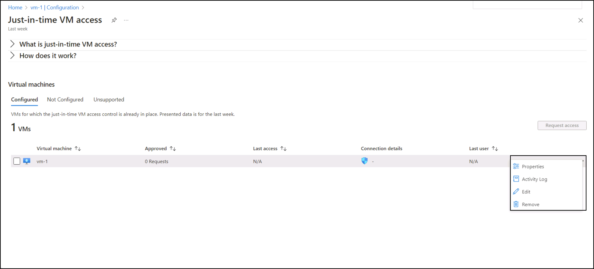
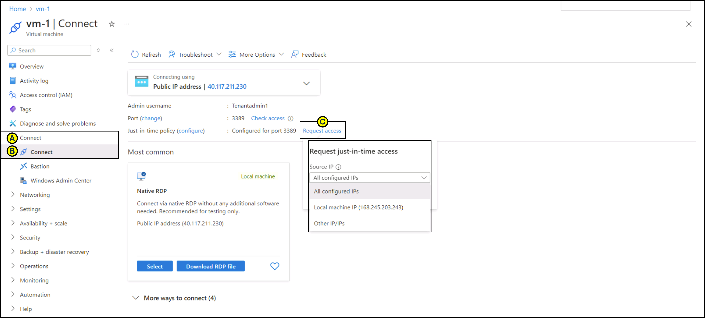

---
lab:
    title: '10 - Enable just-in-time access on VMs'    
    module: 'Module 03 - Configure and manage threat protection by using Microsoft Defender for Cloud'
---

# Lab 10: Enable just-in-time access on VMs

# Student lab manual

## Lab scenario

As an Azure Security Engineer at a financial services company, you're responsible for securing Azure resources, including virtual machines (VMs) that host critical applications. The security team has identified that continuous open access to VMs increases the risk of brute-force attacks and unauthorized access. To mitigate this, the Chief Information Security Officer (CISO) has requested that you enable Just-in-Time (JIT) VM access on a specific Azure VM used for processing financial transactions.

## Lab objectives

In this lab, you will complete the following exercises:

- Exercise 1: Enable JIT on your VMs from the Azure portal.

- Exercise 2: Request access to a VM that has JIT enabled from the Azure portal.

## Exercise instructions 

### Exercise 1: Enable JIT on your VMs from Azure virtual machines

>**Note**: You can enable JIT on a VM from the Azure virtual machines pages of the Azure portal.

1. In the search box at the top of the portal, enter **virtual machines.** Select **Virtual machines** in the search results.

2. Select **myVM.**
 
3. Select **Configuration** from the **Settings** section of **myVM.**
   
4. Under **Just-in-time VM access,** select **Enable just-in-time.**

5. Under **Just-in-time VM access,** click on the link that reads **Open Microsoft Defender for Cloud.**

6. By default, just-in-time access for the VM uses these settings:

   - Windows machines
   
     - RDP port: 3389
     - Maximum allowed access: Three hours
     - Allowed source IP addresses: Any

   - Linux machines
     - SSH port: 22
     - Maximum allowed access: Three hours
     - Allowed source IP addresses: Any
   
7. By default, just-in-time access for the VM uses these settings:

   - From the **Configured** tab, right-click on the VM to which you want to add a port, and select edit.

   
   
   - Under **JIT VM access configuration,** you can either edit the existing settings of an already protected port or add a new custom port.
   - When you've finished editing the ports, select **Save.**   

### Exercise 2: Request access to a JIT-enabled VM from the Azure virtual machine's connect page.

>**Note**: When a VM has a JIT enabled, you have to request access to connect to it. You can request access in any of the supported ways, regardless of how you enabled JIT.
   
1. In the Azure portal, open the virtual machines pages.

2. Select the VM to which you want to connect, and open the **Connect** page.

   - Azure checks to see if JIT is enabled on that VM.

        - If JIT isn't enabled for the VM, you're prompted to enable it.
    
        - If JIT is enabled, select **Request access** to pass an access request with the requesting IP, time range, and ports that were configured for that VM.
    
   

> **Results**: You have explored various methods on how to enable JIT on your VMs and how to request access to VMs that have JIT enabled in Microsoft Defender for Cloud.
