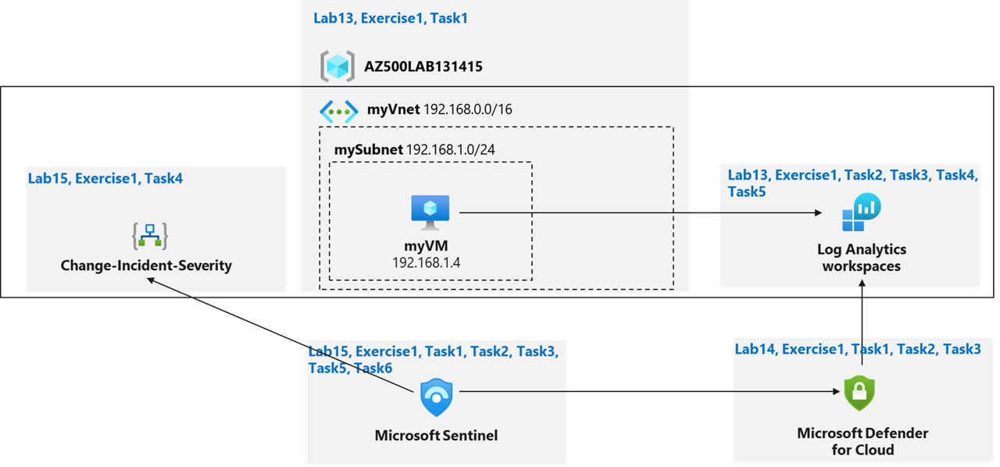

---
lab:
    title: '11 - Microsoft Sentinel'
    module: 'Module 04 - Configure and manage security monitoring and automation solutions'
---

# Lab 11: Microsoft Sentinel
# Student lab manual

## Lab scenario

**Note:** **Azure Sentinel** is renamed to **Microsoft Sentinel** 

You have been asked to create a proof of concept of Microsoft Sentinel-based threat detection and response. Specifically, you want to:

- Start collecting data from Azure Activity and Microsoft Defender for Cloud.
- Add built in and custom alerts 
- Review how Playbooks can be used to automate a response to an incident.

> For all the resources in this lab, we are using the **East US** region. Verify with your instructor this is the region to use for class. 

## Lab objectives

In this lab, you will complete the following exercise:

- Exercise 1: Implement Microsoft Sentinel

## Microsoft Sentinel diagram



## Instructions

## Lab files:

- **\\Allfiles\\Labs\\15\\changeincidentseverity.json**

### Exercise 1: Implement Microsoft Sentinel

### Estimated timing: 30 minutes

In this exercise, you will complete the following tasks:

- Task 1: On-board Microsoft Sentinel
- Task 2: Connect Azure Activity to Sentinel
- Task 3: Create a rule that uses the Azure Activity data connector. 
- Task 4: Create a playbook
- Task 5: Create a custom alert and configure the playbook as an automated response.
- Task 6: Invoke an incident and review the associated actions.

#### Task 1: On-board Microsoft Sentinel

In this task, you will on-board Microsoft Sentinel and connect the Log Analytics workspace. 

1. Sign-in to the Azure portal **`https://portal.azure.com/`**.

    >**Note**: Sign in to the Azure portal using an account that has the Owner or Contributor role in the Azure subscription you are using for this lab.

2. In the Azure portal, in the **Search resources, services, and docs** text box at the top of the Azure portal page, type **Microsoft Sentinel** and press the **Enter** key.

    >**Note**: If this is your first attempt to action Microsoft Sentinel in the Azure dashboard complete the following step(s): In the Azure portal, in the **Search resources,  services, and docs** text box at the top of the Azure portal page, type **Microsoft Sentinel** and press the **Enter** key. Select **Microsoft Sentinel** from the **Services** view.
  
3. On the **Microsoft Sentinel** blade, click **+ Create**.

4. On the **Add Microsoft Sentinel to a workspace** blade, select the Log Analytics workspace you created in the Azure Monitor lab and click **Add**.

    >**Note**: Microsoft Sentinel has very specific requirements for workspaces. For example, workspaces created by Microsoft Defender for Cloud can not be used. Read more at [Quickstart: On-board Microsoft Sentinel](https://docs.microsoft.com/en-us/microsoft/sentinel/quickstart-onboard)
	
#### Task 2: Configure Microsoft Sentinel to use the Azure Activity data connector. 

In this task, you will configure Sentinel to use the Azure Activity data connector.  

1. In the Azure portal, on the **Microsoft Sentinel \| Overview** blade, in the **Content management** section, click **Content hub**.

2. On the **Microsoft Sentinel \| Content hub** blade, review the list of available content.

3. Type **Azure** into the search bar and select the entry representing **Azure Activity**. Review its description at the far right, and then click **Install**.

4. Wait for the **Install Success** notification. In the left navigation panel, in the **Configuration** section, click **Data connectors**.

5. On the **Microsoft Sentinel \| Data connectors** blade, click **Refresh** and review the list of available connectors. Select the entry representing the **Azure Activity** connector (hide the menu bar on the left using \<< if needed), review its description and status at the far right, and then click **Open connector page**.

6. On the **Azure Activity** blade the **Instructions** tab should be selected, note the **Prerequisites** and scroll down to the **Configuration**. Take note of the information describing the connector update. Your subscription never used the legacy connection method so you can skip step 1 (the **Disconnect All** button will be grayed out) and proceed to step 2.

7. In step 2 **Connect your subscriptions through diagnostic settings new pipeline**, review the "Launch the Azure Policy Assignment wizard and follow the steps" instructions then click **Launch the Azure Policy Assignment wizard\>**.

8. On the **Configure Azure Activity logs to stream to specified Log Analytics workspace** (Assign Policy page) **Basics** tab, click the **Scope elipsis (...)** button. In the **Scope** page choose your subscription from the drop-down subscription list and click the **Select** button at the bottom of the page.

    >**Note**: *Do not* choose a Resource Group

9. Click the **Next** button at the bottom of the **Basics** tab twice to proceed to the **Parameters** tab. On the **Parameters** tab click the **Primary Log Analytics workspace elipsis (...)** button. In the **Primary Log Analytics workspace** page, make sure your subscription is selected and use the **workspaces** drop-down to select the Log Analytics workspace you are using for Sentinel. When done click the **Select** button at the bottom of the page.

10. Click the **Next** button at the bottom of the **Parameters** tab to proceed to the **Remediation** tab. On the **Remediation** tab select the **Create a remediation task** checkbox. This will enable the "Configure Azure Activity logs to stream to specified Log Analytics workspace" in the **Policy to remediate** drop-down. In the **System assigned identity location** drop-down, select the region (East US for example) you selected earlier for your Log Analytics workspace.

11. Click the **Next** button at the bottom of the **Remediation** tab to proceed to the **Non-compliance message** tab.  Enter a Non-compliance message if you wish (this is optional) and click the **Review + Create** button at the bottom of the  **Non-compliance message** tab.

12. Click the **Create** button. You should observe three succeeded status messages: **Creating policy assignment succeeded, Role Assignments creation succeeded, and Remediation task creation succeeded**.

    >**Note**: You can check the Notifications, bell icon to verify the three successful tasks.

13. Verify that the **Azure Activity** pane displays the **Data received** graph (you might have to refresh the browser page).  

    >**Note**: It may take over 15 minutes before the Status shows "Connected" and the graph displays Data received.

#### Task 3: Create a rule that uses the Azure Activity data connector. 

In this task, you will review and create a rule that uses the Azure Activity data connector. 

1. On the **Microsoft Sentinel \| Configuration** blade, click **Analytics**. 

2. On the **Microsoft Sentinel \| Analytics** blade, click the **Rule templates** tab. 

    >**Note**: Review the types of rules you can create. Each rule is associated with a specific Data Source.

3. In the listing of rule templates, type **Suspicious** into the search bar form and click the **Suspicious number of resource creation or deployment** entry associated with the **Azure Activity** data source. And then, in the pane displaying the rule template properties, click **Create rule** (scroll to the right of the page if needed).

    >**Note**: This rule has the medium severity. 

4. On the **General** tab of the **Analytics rule wizard - Create a new Scheduled rule** blade, accept the default settings and click **Next: Set rule logic >**.

5. On the **Set rule logic** tab of the **Analytics rule wizard - Create a new Scheduled rule** blade, accept the default settings and click **Next: Incident settings (Preview) >**.

6. On the **Incident settings** tab of the **Analytics rule wizard - Create a new Scheduled rule** blade, accept the default settings and click **Next: Automated response >**. 

    >**Note**: This is where you can add a playbook, implemented as a Logic App, to a rule to automate the remediation of an issue.

7. On the **Automated response** tab of the **Analytics rule wizard - Create a new Scheduled rule** blade, accept the default settings and click **Next: Review and create >**. 

8. On the **Review and create** tab of the **Analytics rule wizard - Create a new Scheduled rule** blade, click **Save**.

    >**Note**: You now have an active rule.

#### Task 4: Create a playbook

In this task, you will create a playbook. A security playbook is a collection of tasks that can be invoked by Microsoft Sentinel in response to an alert. 

1. In the Azure portal, in the **Search resources, services, and docs** text box at the top of the Azure portal page, type **Deploy a custom template** and press the **Enter** key.

2. On the **Custom deployment** blade, click the **Build your own template in the editor** option.

3. On the **Edit template** blade, click **Load file**, locate the **\\Allfiles\\Labs\\15\\changeincidentseverity.json** file and click **Open**.

    >**Note**: You can find sample playbooks at [https://github.com/Azure/Azure-Sentinel/tree/master/Playbooks](https://github.com/Azure/Azure-Sentinel/tree/master/Playbooks).

4. On the **Edit template** blade, click **Save**.

5. On the **Custom deployment** blade, ensure that the following settings are configured (leave any others with their default values):

    |Setting|Value|
    |---|---|
    |Subscription|the name of the Azure subscription you are using in this lab|
    |Resource group|**AZ500LAB131415**|
    |Location|**(US) East US**|
    |Playbook Name|**Change-Incident-Severity**|
    |User Name|your email address|

6. Click **Review + create** and then click **Create**.

    >**Note**: Wait for the deployment to complete.

7. In the Azure portal, in the **Search resources, services, and docs** text box at the top of the Azure portal page, type **Resource groups** and press the **Enter** key.

8. On the **Resource groups** blade, in the list of resource group, click the **AZ500LAB131415** entry.

9. On the **AZ500LAB131415** resource group blade, in the list of resources, click the entry representing the newly created **Change-Incident-Severity** logic app.

10. On the **Change-Incident-Severity** blade, click **Edit**.

    >**Note**: On the **Logic Apps Designer** blade, each of the four s displays a warning. This means that each needs to reviewed and configured.

11. On the **Logic Apps Designer** blade, click the first **s** step.

12. Click **Add new**, ensure that the entry in the **Tenant** drop down list contains your Azure AD tenant name and click **Sign-in**.

13. When prompted, sign in with the user account that has the Owner or Contributor role in the Azure subscription you are using for this lab.

14. Click the second **s** step and, in the list of s, select the second entry, representing the  you created in the previous step.

15. Repeat the previous step for the remaining two **s** steps.

    >**Note**: Ensure there are no warnings displayed on any of the steps.

16. On the **Logic Apps Designer** blade, click **Save** to save your changes.

#### Task 5: Create a custom alert and configure a playbook as an automated response

1. In the Azure portal, navigate back to the **Microsoft Sentinel \| Overview** blade.

2. On the the **Microsoft Sentinel \| Overview** blade, in the **Configuration** section, click **Analytics**.

3. On the **Microsoft Sentinel \| Analytics** blade, click **+ Create** and, in the drop-down menu, click **Scheduled query rule**. 

4. On the **General** tab of the **Analytics rule wizard - Create a new Scheduled rule** blade, specify the following settings (leave others with their default values):

    |Setting|Value|
    |---|---|
    |Name|**Playbook Demo**|
    |Tactics|**Initial Access**|

5. Click **Next: Set rule logic >**.

6. On the **Set rule logic** tab of the **Analytics rule wizard - Create a new Scheduled rule** blade, in the **Rule query** text box, paste the following rule query. 

    ```
    AzureActivity
     | where ResourceProviderValue =~ "Microsoft.Security" 
     | where OperationNameValue =~ "Microsoft.Security/locations/jitNetworkAccessPolicies/delete" 
    ```

    >**Note**: This rule identifies removal of Just-in-time VM access policies.

    >**Note** if you receive a parse error, intellisense may have added values to your query. Ensure the query matches otherwise paste the query into notepad and then from notepad to the rule query. 


7. On the **Set rule logic** tab of the **Analytics rule wizard - Create a new Scheduled rule** blade, in the **Query scheduling** section, set the **Run query every** to **5 Minutes**.

8. On the **Set rule logic** tab of the **Analytics rule wizard - Create a new Scheduled rule** blade, accept the default values of the remaining settings and click **Next: Incident settings >**.

9. On the **Incident settings** tab of the **Analytics rule wizard - Create a new Scheduled rule** blade, accept the default settings and click **Next: Automated response >**. 

10. On the **Automated response** tab of the **Analytic rule wizard - Create a new Scheduled rule** blade, under **Automation rules**, click **+ Add new**.

11. In the **Create new automation rule** window, enter **Run Change-Severity Playbook** for the **Automation rule name**; under the **Trigger** field, click the drop-down menu and select **When alert is created**.

12. In the **Create new automation rule** window, under **Actions**, read the note and then click **Manage playbook permissions**. On the **Manage permissions** window, select the checkbox next to the previously created **Resource group AZ500LAB1314151** and then click **Apply**.

13.  In the **Create new automation rule** window, under **Actions**, click the second drop-down menu and select the **Change-Incident-Severity** logic app. On the **Create new automation rule** window, click **Apply**.

14. On the **Automated response** tab of the **Analytic rule wizard - Create a new Scheduled rule** blade, click **Next: Review and create >** and click **Save**

    >**Note**: You now have a new active rule called **Playbook Demo**. If an event identified by the rue logic occurs, it will result in a medium severity alert, which will generate a corresponding incident.

#### Task 6: Invoke an incident and review the associated actions.

1. In the Azure portal, navigate to the **Microsoft Defender for Cloud \| Overview** blade.

    >**Note**: Check your secure score. By now it should have updated. 

2. On the **Microsoft Defender for Cloud \| Overview** blade, click **Workload protections** under **Cloud Security** in the left navigation.

3. On the **Microsoft Defender for Cloud \| Workload protections** blade, scroll down and click **Just-in-time VM access** tile under **Advanced protection**.

4. On the **Just-in-time VM access** blade, on the right hand side of the row referencing the **myVM** virtual machine, click the **ellipsis (...)** button, click **Remove** and then click **Yes**.

    >**Note:** If the VM is not listed in the **Just-in-time VMs**, navigate to **Virtual Machine** blade and click the **Configuration**, Click the **Enable the Just-in-time VMs** option under the **Just-in-time Vm's access**. Repeat the above step to navigate back to the **Microsoft Defender for Cloud** and refresh the page, the VM will appear.

5. In the Azure portal, in the **Search resources, services, and docs** text box at the top of the Azure portal page, type **Activity log** and press the **Enter** key.

6. Navigate to the **Activity log** blade, note an **Delete JIT Network Access Policies** entry. 

    >**Note**: This may take a few minutes to appear. **Refresh** the page if it does not appear.

7. In the Azure portal, navigate back to the **Microsoft Sentinel \| Overview** blade.

8. On the **Microsoft Sentinel \| Overview** blade, review the dashboard and verify that it displays an incident corresponding to the deletion of the Just-in-time VM access policy.

    >**Note**: It can take up to 5 minutes for alerts to appear on the **Microsoft Sentinel \| Overview** blade. If you are not seeing an alert at that point, run the query rule referenced in the previous task to verify that the Just-in-time access policy deletion activity has been propagated to the Log Analytics workspace associated with your Microsoft Sentinel instance. If that is not the case, re-create the Just-in-time VM access policy and delete it again.

9. On the **Microsoft Sentinel \| Overview** blade, in the **Threat Management** section, click **Incidents**.

10. Verify that the blade displays an incident with either medium or high severity level.

    >**Note**: It can take up to 5 minutes for the incident to appear on the **Microsoft Sentinel \| Incidents** blade. 

    >**Note**: Review the **Microsoft Sentinel \| Playbooks** blade. You will find there the count of succesfull and failed runs.

    >**Note**: You have the option of assigning a different severity level and status to an incident.

> Results: You have created an Microsoft Sentinel workspace, connected it to Azure Activity logs, created a playbook and custom alerts that are triggered in response to the removal of Just-in-time VM access policies, and verified that the configuration is valid.

**Clean up resources**

> Remember to remove any newly created Azure resources that you no longer use. Removing unused resources ensures you will not incur unexpected costs. 

1. In the Azure portal, open the Cloud Shell by clicking the first icon in the top right of the Azure Portal. If prompted, click **PowerShell** and **Create storage**.

2. Ensure **PowerShell** is selected in the drop-down menu in the upper-left corner of the Cloud Shell pane.

3. In the PowerShell session within the Cloud Shell pane, run the following to remove the resource group you created in this lab:
  
    ```powershell
    Remove-AzResourceGroup -Name "AZ500LAB131415" -Force -AsJob
    ```
4. Close the **Cloud Shell** pane.
